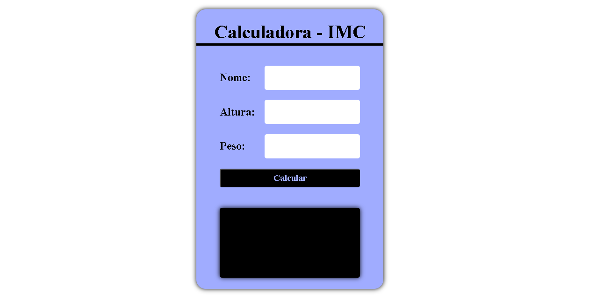

# Calculadora de IMC
## 🖼️ Imagem do Layout



## 📝 Descrição do Projeto

Este é um projeto simples de uma **calculadora de IMC** (Índice de Massa Corporal), desenvolvida com HTML, CSS e JavaScript. A ferramenta permite que você insira seu nome, altura e peso para calcular seu IMC e receber uma classificação, como "Peso ideal" ou "Abaixo do peso".

## 🚀 Funcionalidades

-   **Cálculo do IMC**: Calcula o índice de massa corporal com base na altura e peso fornecidos.
-   **Classificação**: Classifica o resultado do IMC em categorias como `Abaixo do peso`, `Peso ideal`, `Levemente acima do peso`, `Obesidade grau I`, `Obesidade grau II` e `Obesidade grau III`.
-   **Validação**: Exibe uma mensagem de erro se o usuário tentar calcular sem preencher todos os campos.

## 🛠️ Tecnologias Utilizadas

-   `HTML`: Estrutura da página.
-   `CSS`: Estilização e layout.
-   `JavaScript`: Lógica de cálculo e manipulação do DOM.

## 🔗 Acesse o Projeto

Você pode visualizar a aplicação em funcionamento através do [GitHub Pages](https://seunomedeusuario.github.io/calculadora-imc/).

## 👨‍💻 Como Rodar o Projeto

1.  Clone este repositório:
    ```bash
    git clone [https://github.com/seunomedeusuario/calculadora-imc.git](https://github.com/seunomedeusuario/calculadora-imc.git)
    ```
2.  Navegue até o diretório do projeto:
    ```bash
    cd calculadora-imc
    ```
3.  Abra o arquivo `index.html` em seu navegador para ver o projeto em ação.

## 📌 Status do Projeto

`Concluído`

## 📧 Contato

Se você tiver alguma dúvida ou sugestão, sinta-se à vontade para entrar em contato comigo.
[](mailto:kamiseara14@gmail.com)
